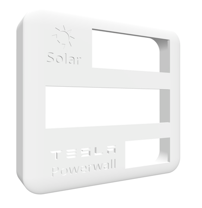

# Powerwall-Display
Tesla Powerwall display based on 7-segment TM1637 displays and ESP8266 to show current solar generation, powerwall (power and percentage), grid and load power usage. 

[](https://www.youtube.com/watch?v=8YzZw6ldIqQ "Play Video")

## 3D Printed Model
The 3D printed case houses the ESP8266 WeMos controller, two 4-digit displays and one 6-digit display.  The model has a cutout TESLA logo that can be backlit.

* Thingiverse - [Link](https://www.thingiverse.com/thing:5113169)
* Local STL - [Link](TeslaSolarDisplay.stl)
* Tinkercad Original - [Link](https://www.tinkercad.com/things/3FTXlFyVO4z-tesla-solar-display)



## Electronics
The following components were used to build this kit:
* ESP8266 WeMos D1 Mini Controller - [Amazon](https://www.amazon.com/dp/B081PX9YFV/ref=cm_sw_em_r_mt_dp_48GWNB0ZD5XM511K98T9) | [AliExpress](https://www.aliexpress.com/item/1005001636509632.html?spm=a2g0s.9042311.0.0.21a34c4dPgfOzp)
* TM1637 0.56" 4-Digit LED Segment Display (White/Yellow) - [Amazon](https://www.amazon.com/dp/B07MCGDST2/ref=cm_sw_em_r_mt_dp_YD20SFT79CEE5465E9R0?_encoding=UTF8&psc=1) 
* TM1637 0.36" 4-Digit LED Segment Display (Green) - [Amazon](https://www.amazon.com/dp/B01DKISMXK/ref=cm_sw_em_r_mt_dp_17NDHA13Q8GRYH0W5KTG?_encoding=UTF8&psc=1)
* TM1637 0.56" 6-Digit LED Segment Display (Red) - [Amazon](https://www.amazon.com/dp/B08G1RYYTQ/ref=cm_sw_em_r_mt_dp_FHDSB6FT03TFHVS02QKB) | [AliExpress](https://www.aliexpress.com/item/1005002060120661.html?spm=a2g0s.9042311.0.0.21a34c4dPgfOzp)
* Optional - Green LEDs for Logo Backlight

## Powerwall Proxy
The display uses the `pyPowerwall` proxy to connect with the Powerwall API. You you will need to install this on a local system (Raspberry Pi, Linux or Windows system) that is alway running so that the display can pull the latest data. The proxy can be installed as a docker container.  Be sure to update the password, email, Powerwall host IP address and Timezone.

Proxy Install Instructions:

```bash
docker run \
    -d \
    -p 8675:8675 \
    -e PW_PASSWORD='your-powerwall-password' \
    -e PW_EMAIL='your-powerwall-email' \
    -e PW_HOST='your-powerwall-ip-address' \
    -e PW_TIMEZONE='America/Los_Angeles' \
    -e PW_DEBUG='yes' \
    -e PW_CACHE_EXPIRE='20' \
    --name pypowerwall \
    --restart unless-stopped \
    jasonacox/pypowerwall
```

## Arduino Code
The code uses TM1637TinyDisplay to drive the 7-segment 4-digit and 6-digit displays.  The Arudino sketch is located [here](Powerwall-Display/Powerwall-Display.ino).

Update the Configuration Section for your Setup in the sketch:

```c++
// Configuration Settings           
#define FILTER 50               // Zero out power values less than this
#define PROXYHOST "10.0.x.x"    // Address of Proxy Server
#define PROXYPORT 8675          // Port of Proxy Server (default=8675)

// Wifi Configuration 
const char* WIFI_SSID = "WIFI_SSID";
const char* WIFI_PWD  = "WIFI_PASSWORD";

// Display GPIO Pins (Clock and Data)
#define CLK1 5    // Display 1 - 4-digit
#define DIO1 4
#define CLK2 14   // Display 2 - 6-digit
#define DIO2 12
#define CLK3 13   // Display 3 - 4-digit
#define DIO3 16
```

