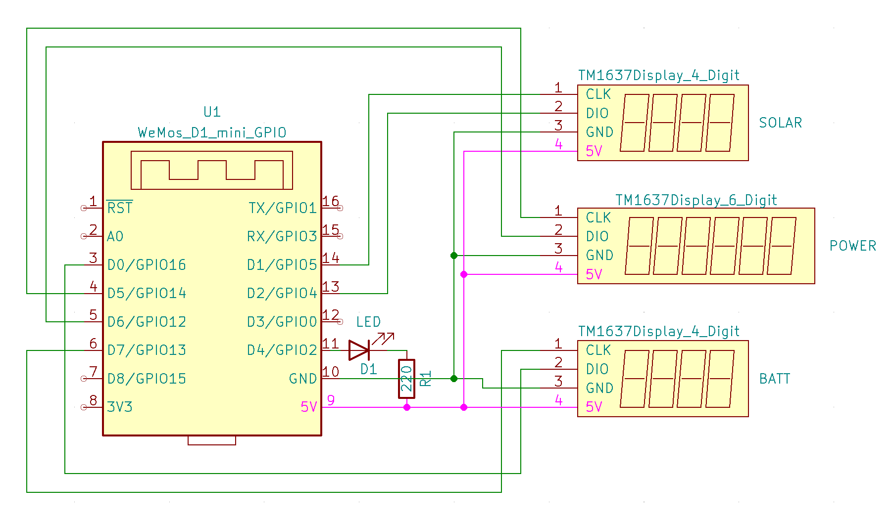

# Powerwall-Display
Tesla Powerwall display based on 7-segment TM1637 displays and ESP8266 to show current solar generation, powerwall (power and percentage), grid and load power usage. 

[](https://www.youtube.com/watch?v=8YzZw6ldIqQ "Play Video")

* Display1 (4-digit white/yellow): Solar Power Generated
* Display2 (6-digit red): Rotates thought the following Power metrics:
    * (H)ouse Load
    * (E)lectric Grid + direction animation
    * (P)owerwall Battery + direction animation
* Display3 (4-digit green): Powerwall Battery (% Full) + animation for charge/discharge

The display will show values in watts (W) for 1-9999W values and kilowatts (kW) for 10.0kW and above.
     
## 3D Printed Model
The 3D printed case houses the ESP8266 WeMos controller, two 4-digit displays and one 6-digit display.  The model has a cutout TESLA logo that can be backlit.

* Thingiverse - [Link](https://www.thingiverse.com/thing:5113169)
* Local STL - [Link](TeslaSolarDisplay.stl)
* Tinkercad Original - [Link](https://www.tinkercad.com/things/3FTXlFyVO4z-tesla-solar-display)


## Electronics
The following components were used to build this kit:
* ESP8266 WeMos D1 Mini Controller - [Amazon](https://www.amazon.com/dp/B081PX9YFV/ref=cm_sw_em_r_mt_dp_48GWNB0ZD5XM511K98T9) | [AliExpress](https://www.aliexpress.com/item/1005001636509632.html?spm=a2g0s.9042311.0.0.21a34c4dPgfOzp)
* TM1637 0.56" 4-Digit LED Segment Display (White/Yellow) - [Amazon](https://www.amazon.com/dp/B07MCGDST2/ref=cm_sw_em_r_mt_dp_YD20SFT79CEE5465E9R0?_encoding=UTF8&psc=1) 
* TM1637 0.36" 4-Digit LED Segment Display (Green) - [Amazon](https://www.amazon.com/dp/B01DKISMXK/ref=cm_sw_em_r_mt_dp_17NDHA13Q8GRYH0W5KTG?_encoding=UTF8&psc=1)
* TM1637 0.56" 6-Digit LED Segment Display (Red) - [Amazon](https://www.amazon.com/dp/B08G1RYYTQ/ref=cm_sw_em_r_mt_dp_FHDSB6FT03TFHVS02QKB) | [AliExpress](https://www.aliexpress.com/item/1005002060120661.html?spm=a2g0s.9042311.0.0.21a34c4dPgfOzp)
* Optional - Green LEDs for Logo Backlight

## Powerwall Proxy
The display uses the [pyPowerwall proxy](https://github.com/jasonacox/pypowerwall/tree/main/proxy#pypowerwall-proxy-server) to connect with the Powerwall API. You you will need to install this on a local system (Raspberry Pi, Linux or Windows system) that is always running so that the display can pull the latest data. The proxy can be installed as a docker container.  Be sure to update the password, email, Powerwall host IP address and Timezone.

Proxy Install Instructions using Docker:

```bash
docker run \
    -d \
    -p 8675:8675 \
    -e PW_PASSWORD='your-powerwall-password' \
    -e PW_EMAIL='your-powerwall-email' \
    -e PW_HOST='your-powerwall-ip-address' \
    -e PW_TIMEZONE='America/Los_Angeles' \
    -e PW_CACHE_EXPIRE='20' \
    --name pypowerwall \
    --restart unless-stopped \
    jasonacox/pypowerwall
```

## Arduino Code
The code uses the [TM1637TinyDisplay](https://github.com/jasonacox/TM1637TinyDisplay) Arduino library to drive the 7-segment 4-digit and 6-digit displays (see installation [instructions here](https://github.com/jasonacox/TM1637TinyDisplay#installation)).

1. Use the Arudino sketch located [here](Powerwall-Display/Powerwall-Display.ino).

2. Update the Configuration Section for your Setup in the sketch:

```c++
// Configuration Settings           
#define FILTER 50               // Zero out power values less than this
#define PROXYHOST "10.0.x.x"    // Address of Proxy Server
#define PROXYPORT 8675          // Port of Proxy Server (default=8675)

// Wifi Configuration 
const char* WIFI_SSID = "WIFI_SSID";
const char* WIFI_PWD  = "WIFI_PASSWORD";

// Display GPIO Pins (Clock and Data)
#define CLK1 5    // Display 1 - 4-digit for SOLAR power display (Yellow)
#define DIO1 4
#define CLK2 14   // Display 2 - 6-digit for POWER display for Grid, Home and Powerwall (Red)
#define DIO2 12
#define CLK3 13   // Display 3 - 4-digit for BATTERY percentage (Green)
#define DIO3 16
#define TESLA 0   // Optional Tesla Logo LED
```

## Schematic

The cirucit is fairly simple. As noted above in the code, the ESP8266 module will need to drive the CLK (clock) and DIO (data) input on three different display modules, one 6-digit modules and two 4-digit modules. There is an optional output for the Logo LED.


